# Creare un'app console C# in Visual Studio

In questa esercitazione per C# si userà Visual Studio per creare ed eseguire un'app console ed esplorare nello stesso tempo alcune funzionalità dell'ambiente di sviluppo integrato **IDE** (*Integrated Development Environment*) di Visual Studio.

Se Visual Studio non è ancora installato, accedere alla pagina [Download di Visual Studio](https://visualstudio.microsoft.com/downloads/?utm_medium=microsoft&utm_source=docs.microsoft.com&utm_campaign=inline+link&utm_content=download+vs2019) per installarlo gratuitamente.


## Creare un progetto

 Per prima cosa, si creerà un progetto di app C#. Il tipo di progetto include fin dall'inizio tutti i file modello necessari.

1. Aprire Visual Studio 2019.
2. Nella finestra iniziale scegliere ***Crea un nuovo progetto***.
3. Nella finestra ***Crea un nuovo progetto*** immettere o digitare *console* nella casella di ricerca. Scegliere quindi **C#**  dall'elenco ***Linguaggio*** e ***Windows*** dall'elenco ***Piattaforma***.

Dopo aver applicato i filtri di linguaggio e piattaforma, scegliere il modello ***App console (.NET Core)*** e quindi scegliere ***Avanti***.

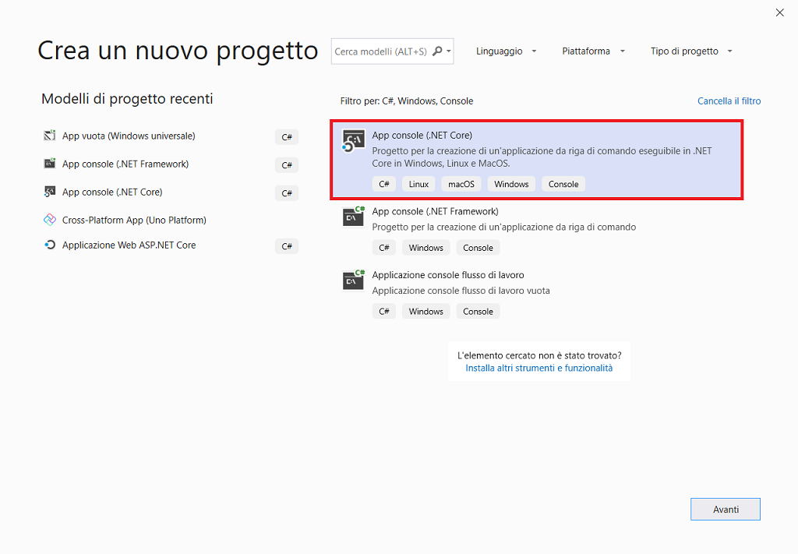

 Se il modello ***App console (.NET Core)*** non è visualizzato, è possibile installarlo dalla finestra ***Crea un nuovo progetto***. Nel messaggio ***L'elemento cercato non è stato trovato?*** scegliere il collegamento ***Installa altri strumenti e funzionalità***.

 Scegliere quindi il carico di lavoro ***Sviluppo multipiattaforma .NET Core*** nel programma d'installazione di Visual Studio.

 Scegliere quindi il pulsante ***Modifica*** nel programma d'installazione di Visual Studio. Quando è richiesto, salvare il lavoro. Scegliere quindi ***Continua*** per installare il carico di lavoro. 

4. Nella finestra ***Configura il nuovo progetto*** digitare o immettere *Calcolatrice* nella casella ***Nome del progetto***. Scegliere ***Crea***.

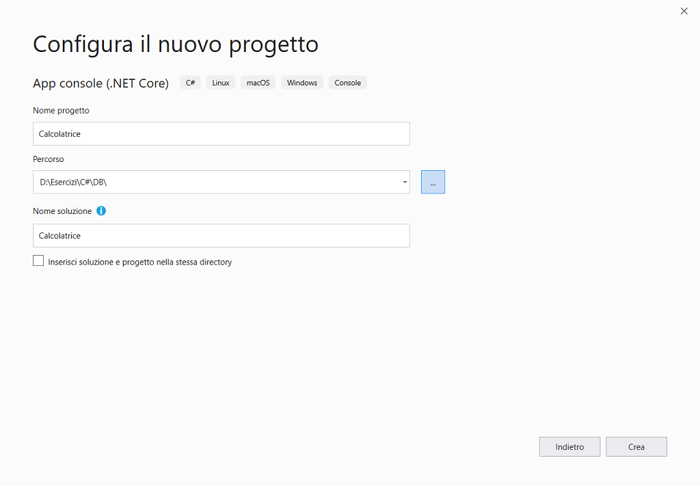

Visual Studio aprirà il nuovo progetto che include il codice `Hello World` predefinito.

 

## Creare l'app

 Prima di tutto si esamineranno alcuni calcoli matematici integer di base in C#. Si aggiungerà quindi il codice necessario per creare una calcolatrice di base. In seguito, si procederà al debug dell'app per trovare eventuali errori e correggerli. E infine si perfezionerà il codice per renderlo più efficiente.

###  Esplorare le operazioni matematiche su interi

 S'inizierà con alcune operazioni matematiche di base su interi in C#.

1.  Nell'editor del codice, eliminare il codice `Hello World` predefinito. In particolare, eliminare la riga con la dicitura `Console.WriteLine("Hello World!");`.

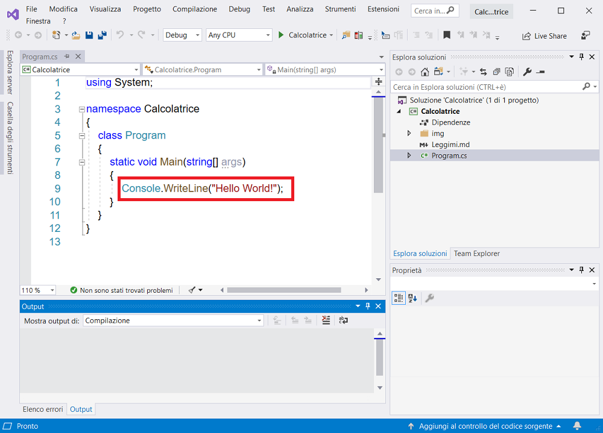

Al suo posto digitare il codice seguente.

```csharp
using static System.Console;

namespace Calcolatrice
{
    internal class Program
    {
        private static void Main(string[] args)
        {
            Clear();
            int a = 42;
            int b = 119;
            int c = a + b;
            WriteLine(c);
            ReadKey();
        }
    }
}
```

Sarà quindi possibile notare che la funzionalità IntelliSense in Visual Studio offrirà l'opzione per completare automaticamente l'inserimento.


Scegliere *Calcolatrice* per eseguire l'app oppure premere ***F5***

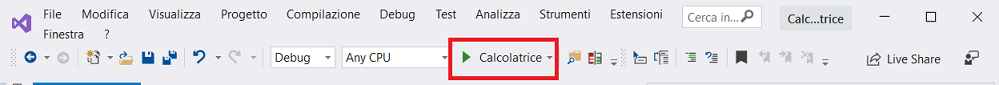

Si aprirà una finestra della console che visualizza la somma di 42 + 119, vale a dire **161**.

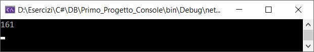

È possibile modificare l'operatore per modificare il risultato. Nella riga di codice `int c = a + b;` è ad esempio possibile modificare l'operatore `+` in `-` per la sottrazione, `*` per la moltiplicazione o `/` per la divisione. A questo punto, quando l'app sarà eseguita, il risultato cambierà.

Chiudere la finestra della console.

### Aggiungere codice per creare un'app di calcolo

 Si continuerà aggiungendo un set più complesso di codice di calcolo al progetto.

1. Eliminare tutto il codice visualizzato nell'editor del codice.
2. Digitare o incollare il codice seguente nell'editor del codice, file Uno_Calcolatrice.cs.

```csharp
using System;
using static System.Console;

internal class Uno_Calcolatrice
{
    public static void Run()
    {
        // visualizzare il titolo come app per la calcolatrice della console di C#
        WriteLine("Calcolatrice console in C #\r");
        WriteLine("--------------------------\n");
        // chiedere all'utente di digitare il primo numero
        Write("Digitare un numero e quindi premere INVIO\t");
        // dichiarare le variabili
        int num1 = Convert.ToInt32(ReadLine());
        // chiedere all'utente di digitare il secondo numero
        Write("Digitare un altro numero e quindi premere INVIO\t");
        int num2 = Convert.ToInt32(ReadLine());
        // chiedere all'utente di scegliere un'opzione
        WriteLine("Scegliere un'opzione dall'elenco seguente:");
        WriteLine("\t1 - Somma");
        WriteLine("\t2 - Sottrazione");
        WriteLine("\t3 - Moltiplicazione");
        WriteLine("\t4 - Divisione");
        Write("La tua opzione? ");
        // utilizzare un'istruzione switch per eseguire le operazioni matematiche
        switch (ReadLine())
        {
            case "1":
                WriteLine($"Il tuo risultato: {num1} + {num2} = " + (num1 + num2));
                break;

            case "2":
                WriteLine($"Il tuo risultato: {num1} - {num2} = " + (num1 - num2));
                break;

            case "3":
                WriteLine($"Il tuo risultato: {num1} * {num2} = " + (num1 * num2));
                break;

            case "4":
                WriteLine($"Il tuo risultato: {num1} / {num2} = " + (num1 / num2));
                break;
        }
    }
}
```

Digitare o incollare il codice seguente nell'editor del codice, file Program.cs.

```csharp
using static System.Console;

namespace Calcolatrice
{
    internal class Program
    {
        private static void Main(string[] args)
        {
            Clear();
            Uno_Calcolatrice.Run();
            ReadKey();
        }
    }
}
```

Scegliere *Calcolatrice* per eseguire l'app oppure premere ***F5***

Visualizzare l'app nella finestra della console, quindi seguire il prompt per aggiungere i numeri **42** e **119**.

L'app avrà un aspetto simile allo screenshot seguente.


### Aggiungere i numeri decimali

 L'app *Calcolatrice* attualmente accetta e restituisce numeri interi. Sarà tuttavia più precisa se si aggiunge il codice che consente di elaborare numeri decimali.

 Come illustrato nello screenshot seguente, se si esegue l'app e si divide il numero 42 per 119, si ottiene come risultato 0, che non è esatto.

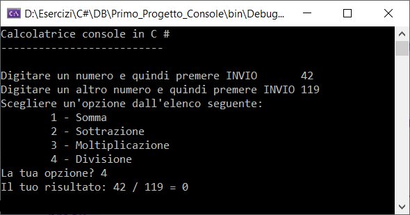

È necessario correggere il codice in modo che gestisca i numeri decimali.

1. Premere **CTRL+F** per aprire il controllo **Trova e sostituisci**.

2. Sostituire ogni istanza della variabile `int` con `float`.

   Assicurarsi di aver attivato/disattivato **Maiuscole/minuscole** (**Alt**+**C**) e **Parola intera** (**Alt** + **W**) nel controllo **Trova e sostituisci**.


Digitare o incollare il codice seguente nell'editor del codice, file Due_Calcolatrice.cs.

```csharp
using System;
using static System.Console;

internal class Due_Calcolatrice
{
    public static void Run()
    {
        // visualizzare il titolo come app per la calcolatrice della console di C#
        WriteLine("Calcolatrice console in C #\r");
        WriteLine("--------------------------\n");
        // chiedere all'utente di digitare il primo numero
        Write("Digitare un numero e quindi premere INVIO\t");
        // dichiarare le variabili
        float num1 = Convert.ToInt32(ReadLine());
        // chiedere all'utente di digitare il secondo numero
        Write("Digitare un altro numero e quindi premere INVIO\t");
        float num2 = Convert.ToInt32(ReadLine());
        // chiedere all'utente di scegliere un'opzione
        WriteLine("Scegliere un'opzione dall'elenco seguente:");
        WriteLine("\t1 - Somma");
        WriteLine("\t2 - Sottrazione");
        WriteLine("\t3 - Moltiplicazione");
        WriteLine("\t4 - Divisione");
        Write("La tua opzione? ");
        // utilizzare un'istruzione switch per eseguire le operazioni matematiche
        switch (ReadLine())
        {
            case "1":
                WriteLine($"Il tuo risultato: {num1} + {num2} = " + (num1 + num2));
                break;

            case "2":
                WriteLine($"Il tuo risultato: {num1} - {num2} = " + (num1 - num2));
                break;

            case "3":
                WriteLine($"Il tuo risultato: {num1} * {num2} = " + (num1 * num2));
                break;

            case "4":
                WriteLine($"Il tuo risultato: {num1} / {num2} = " + (num1 / num2));
                break;
        }
    }
}
```

 Come illustrato nello screenshot seguente, se si esegue l'app e si divide il numero 42 per 119, l'app ora restituisce un valore numerico decimale invece di zero.

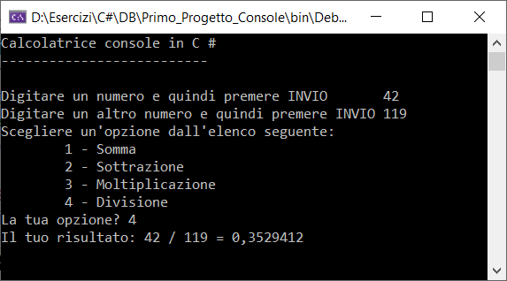

Tuttavia, l'app genera solo un risultato decimale. Modificando ancora il codice, è possibile fare in modo che l'app esegua anche calcoli con numeri decimali.

1. Usare il controllo **Trova e sostituisci** (**CTRL** + **F**) per sostituire ogni istanza della variabile `float` con `double` e quindi sostituire ogni istanza del metodo `Convert.ToInt32` con `Convert.ToDouble`.

Digitare o incollare il codice seguente nell'editor del codice, file Tre_Calcolatrice.cs.

```csharp
using System;
using static System.Console;

internal class Tre_Calcolatrice
{
    public static void Run()
    {
        // visualizzare il titolo come app per la calcolatrice della console di C#
        WriteLine("Calcolatrice console in C #\r");
        WriteLine("--------------------------\n");
        // chiedere all'utente di digitare il primo numero
        Write("Digitare un numero e quindi premere INVIO\t");
        // dichiarare le variabili
        double num1 = Convert.ToDouble(ReadLine());
        // chiedere all'utente di digitare il secondo numero
        Write("Digitare un altro numero e quindi premere INVIO\t");
        double num2 = Convert.ToDouble(ReadLine());
        // chiedere all'utente di scegliere un'opzione
        WriteLine("Scegliere un'opzione dall'elenco seguente:");
        WriteLine("\t1 - Somma");
        WriteLine("\t2 - Sottrazione");
        WriteLine("\t3 - Moltiplicazione");
        WriteLine("\t4 - Divisione");
        Write("La tua opzione? ");
        // utilizzare un'istruzione switch per eseguire le operazioni matematiche
        switch (ReadLine())
        {
            case "1":
                WriteLine($"Il tuo risultato: {num1} + {num2} = " + (num1 + num2));
                break;

            case "2":
                WriteLine($"Il tuo risultato: {num1} - {num2} = " + (num1 - num2));
                break;

            case "3":
                WriteLine($"Il tuo risultato: {num1} * {num2} = " + (num1 * num2));
                break;

            case "4":
                WriteLine($"Il tuo risultato: {num1} / {num2} = " + (num1 / num2));
                break;
        }
    }
}
```

Eseguire nuovamente l'app *Calcolatrice* e dividere il numero **42,5** per il numero **119,75**.

Si noti che l'app ora accetta valori decimali e restituisce un valore numerico decimale più lungo come risultato.

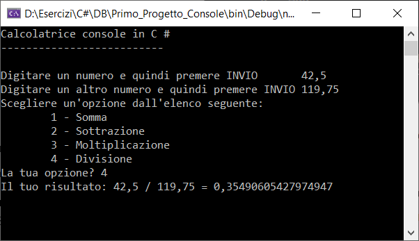


## Eseguire il debug dell'app

 L'app *Calcolatrice* di base è stata migliorata ma non comprende ancora funzioni di sicurezza che consentono di gestire le eccezioni, ad esempio gli errori di input dell'utente.

 Ad esempio, se si tenta di dividere un numero per zero oppure d'immettere un carattere alfabetico quando l'app si aspetta un carattere numerico (o viceversa), l'app smette di funzionare e restituisce un errore.

 Si procederà ora a esaminare alcuni errori d'input comuni degli utenti, individuandoli nel debugger e risolvendoli nel codice.

 Per altre informazioni sul debugger e sul suo funzionamento, vedere la pagina [Presentazione del debugger di Visual Studio](https://docs.microsoft.com/it-it/visualstudio/debugger/debugger-feature-tour?view=vs-2019).

### Correggere l'errore di divisione per zero

 Quando si tenta di dividere un numero per zero, l'app console si blocca. Visual Studio mostra quindi qual è il problema nell'editor del codice.

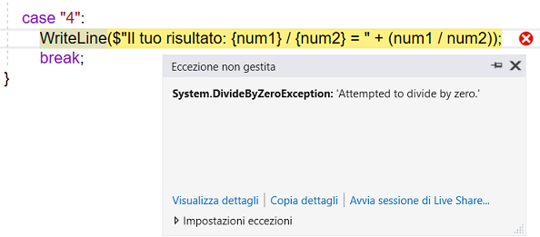

Ora il codice sarà modificato per gestire questo errore.

 Eliminare il codice che è visualizzato tra `case "4":`

Digitare o incollare il codice seguente nell'editor del codice, file Quattro_Calcolatrice.cs.

```csharp
using System;
using static System.Console;

internal class Quattro_Calcolatrice
{
    public static void Run()
    {
        // visualizzare il titolo come app per la calcolatrice della console di C#
        WriteLine("Calcolatrice console in C #\r");
        WriteLine("--------------------------\n");
        // chiedere all'utente di digitare il primo numero
        Write("Digitare un numero e quindi premere INVIO\t");
        // dichiarare le variabili
        double num1 = Convert.ToDouble(ReadLine());
        // chiedere all'utente di digitare il secondo numero
        Write("Digitare un altro numero e quindi premere INVIO\t");
        double num2 = Convert.ToDouble(ReadLine());
        // chiedere all'utente di scegliere un'opzione
        WriteLine("Scegliere un'opzione dall'elenco seguente:");
        WriteLine("\t1 - Somma");
        WriteLine("\t2 - Sottrazione");
        WriteLine("\t3 - Moltiplicazione");
        WriteLine("\t4 - Divisione");
        Write("La tua opzione? ");
        // utilizzare un'istruzione switch per eseguire le operazioni matematiche
        switch (ReadLine())
        {
            case "1":
                WriteLine($"Il tuo risultato: {num1} + {num2} = " + (num1 + num2));
                break;

            case "2":
                WriteLine($"Il tuo risultato: {num1} - {num2} = " + (num1 - num2));
                break;

            case "3":
                WriteLine($"Il tuo risultato: {num1} * {num2} = " + (num1 * num2));
                break;

            case "4":
                // chiedere all'utente d'immettere un divisore diverso da zero fino a quando non lo fa
                while (num2 == 0)
                {
                    Write("Immettere un divisore diverso da zero:\t");
                    num2 = Convert.ToInt32(ReadLine());
                }
                WriteLine($"Il tuo risultato: {num1} / {num2} = " + (num1 / num2));
                break;
        }
    }
}
```

Ora, quando si divide un numero qualsiasi per zero, l'app richiederà un altro numero. Anzi, continua a richiedere un numero diverso da zero finché l'utente non ne fornisce uno.

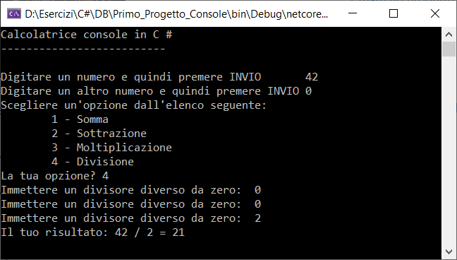

### Correggere l'errore di formato

 Se s'immette un carattere alfabetico quando l'app si aspetta un carattere numerico (o viceversa), l'app console si blocca. Visual Studio mostra quindi qual è il problema nell'editor del codice.

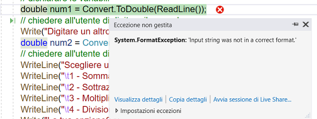

Per correggere questo errore, è necessario effettuare il refactoring del codice immesso in precedenza.

Anziché affidare la gestione dell'intero codice alla classe `Program`, si dividerà l'app in due classi: `Calcolatrice` e `Program`.

 La classe `Calcolatrice` si occuperà di gestire la maggior parte del lavoro di calcolo mentre la classe `Program` gestirà l'interfaccia utente e il lavoro di acquisizione degli errori.

 Digitare o incollare il codice seguente nell'editor del codice, file Refactoring_Calcolatrice.cs.

```csharp
internal class Refactoring_Calcolatrice
{
    public static double DoOperation(double num1, double num2, string op)
    {
        /* il valore di default è NaN (Not-a-Number) che usiamo se un'operazione,
         * ad esempio la divisione, potrebbe generare un errore */
        double result = double.NaN;
        // utilizzare un'istruzione switch per eseguire le operazioni matematiche
        switch (op)
        {
            case "1":
                result = num1 + num2;
                break;

            case "2":
                result = num1 - num2;
                break;

            case "3":
                result = num1 * num2;
                break;

            case "4":
                // chiedere all'utente d'immettere un divisore diverso da zero fino a quando non lo fa
                if (num2 != 0)
                {
                    result = num1 / num2;
                }
                break;
            // restituisce il testo per una voce di opzione non corretta
            default:
                break;
        }
        return result;
    }
}
```

 Digitare o incollare il codice seguente nell'editor del codice, file Program.cs.

```csharp
using System;
using static System.Console;

namespace Calcolatrice
{
    internal class Program
    {
        private static void Main(string[] args)
        {
            Clear();
            //Uno_Calcolatrice.Run();
            //Due_Calcolatrice.Run();
            //Tre_Calcolatrice.Run();
            //Quattro_Calcolatrice.Run();
            //*******************************************
            ConsoleKeyInfo cki;
            do
            {
                Clear();
                // visualizzare il titolo come app per la calcolatrice della console di C#
                WriteLine("Calcolatrice console in C #\r");
                WriteLine("--------------------------\n");
                // dichiarare le variabili e impostarle a nulle
                string numInput1 = "";
                string numInput2 = "";
                double result = 0;
                // chiedere all'utente di digitare il primo numero
                Write("Digitare un numero e quindi premere INVIO\t\t\t");
                numInput1 = ReadLine();
                double cleanNum1 = 0;
                while (!double.TryParse(numInput1, out cleanNum1))
                {
                    Write("Questo non è un input valido. Immettere un valore numerico:\t");
                    numInput1 = ReadLine();
                }
                // chiedere all'utente di digitare il secondo numero
                Write("Digitare un altro numero e quindi premere INVIO\t\t\t");
                numInput2 = ReadLine();
                double cleanNum2 = 0;
                while (!double.TryParse(numInput2, out cleanNum2))
                {
                    Write("Questo non è un input valido. Immettere un valore numerico:\t");
                    numInput2 = ReadLine();
                }
                // chiedere all'utente di scegliere un'opzione
                WriteLine("Scegliere un'opzione dall'elenco seguente:");
                WriteLine("\t1 - Somma");
                WriteLine("\t2 - Sottrazione");
                WriteLine("\t3 - Moltiplicazione");
                WriteLine("\t4 - Divisione");
                Write("La tua opzione? ");
                string op = ReadLine();
                try
                {
                    result = Refactoring_Calcolatrice.DoOperation(cleanNum1, cleanNum2, op);
                    if (double.IsNaN(result))
                        WriteLine("Questa operazione comporterà un errore matematico!\n");
                    else
                        WriteLine("Il tuo risultato: {0:0.##}\n", result);
                }
                catch (Exception e)
                {
                    WriteLine("Si è verificata un'eccezione durante i calcoli!\n - Dettagli: " + e.Message);
                }
                WriteLine("------------------------\n");
                // attendere che l'utente risponda prima della chiusura
                Write("Premere ESC per terminare, un tasto qualsiasi per continuare.");
                cki = ReadKey();
            } while (cki.Key != ConsoleKey.Escape);
        }
    }
}
```

Si noti che è disponibile l'opzione per immettere più equazioni fino a quando non si sceglie di chiudere l'app console. Inoltre, è anche stato ridotto il numero di posizioni decimali nel risultato.

Visualizzare l'app nella finestra della console, quindi seguire il prompt per aggiungere i numeri **42,5** e **119,75**.

L'app avrà un aspetto simile allo screenshot seguente.

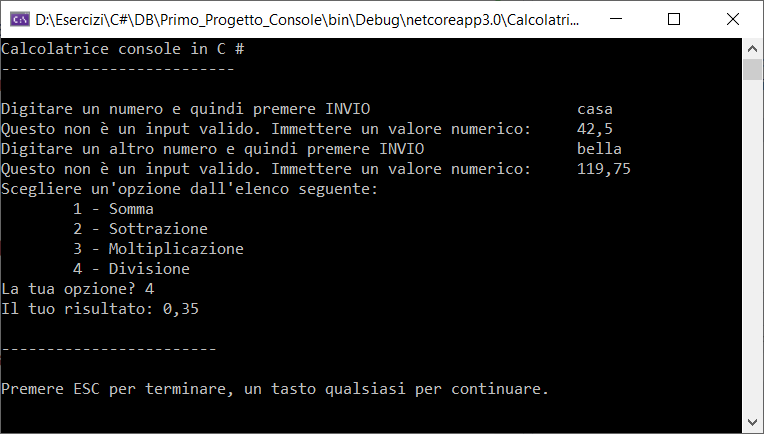

Soluzione.

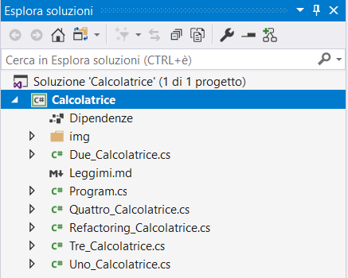