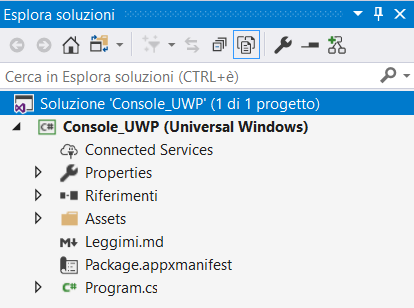
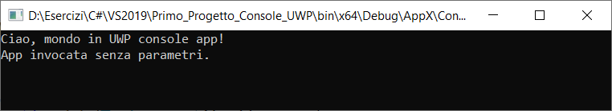

# App Console UWP




Ci sono diversi casi in cui un'app potrebbe avere senso di esistere anche senza l'UI, tra cui:

- le utility che richiedono un semplice input dall'utente per eseguire operazioni automatiche in background;
- sistemi headless, specialmente nel mondo dell'IoT, in cui i sistemi sono completamente autonomi.
Per creare un'app console però, si è sempre ricorsi all'uso di Win32 anziché all'UWP poiché
è mancato il supporto per tutta la parte relativa ai namespace `System.Console` e al multi-instancing.

Modificare manualmente il file di manifest.

```xml
<Extensions>
<Extensions>
    <uap5:Extension Category="windows.appExecutionAlias" Executable="Console_UWP.exe" EntryPoint="Console_UWP.App">
        <uap5:AppExecutionAlias desktop4:Subsystem="console" iot2:Subsystem="console">
            <uap5:ExecutionAlias Alias="Console_UWP.exe" />
        </uap5:AppExecutionAlias>
    </uap5:Extension>
</Extensions>
```

All'interno del nodo `<Application>` del file di manifest è stata aggiunta l'estensione `windows.appExecutionAlias` che permette di specificare la tipologia di subsystem che dev'essere utilizzato, ovvero console. 
La registrazione è stata fatta per due specifici ambienti, desktop e IoT, perché sono le uniche due SKU attualmente supportate e che permettono l'esecuzione della shell. 
I due namespace sono registrati nel modo seguente.

```xml
<Package
  xmlns="http://schemas.microsoft.com/appx/manifest/foundation/windows10"
  xmlns:mp="http://schemas.microsoft.com/appx/2014/phone/manifest"
  xmlns:uap="http://schemas.microsoft.com/appx/manifest/uap/windows10"
  xmlns:uap5="http://schemas.microsoft.com/appx/manifest/uap/windows10/5"
  xmlns:desktop4="http://schemas.microsoft.com/appx/manifest/desktop/windows10/4"
  xmlns:iot2="http://schemas.microsoft.com/appx/manifest/iot/windows10/2"
  IgnorableNamespaces="uap mp desktop4 iot2">

```

Una volta definito il subsystem, è necessario andare ad eliminare tutto l'entrypoint definito dall'App.xaml 
ed eventuali altre pagine che contengono XAML/UI, poiché infatti non è possibile avere due entrypoint diversi, oppure lanciare dalla shell anche la relativa GUI. 
Quindi creare il sistema di accesso all'app tramite la classe `Program` e il metodo `Main`.

```csharp
using System;
using static System.Console;

namespace Console_UWP
{
    public class Program
    {
        public static void Main(string[] args)
        {
            Clear();
            WriteLine("Ciao, mondo in UWP console app!");
            var parameters = string.Join(Environment.NewLine, args);
            if (string.IsNullOrEmpty(parameters))
                WriteLine("App invocata senza parametri.");
            else
                WriteLine($"App invocata con i parametri: {Environment.NewLine}{parameters}");
            ReadKey();
        }
    }
}
```

Una volta creata e deployata l'app, è possibile invocarla direttamente dal prompt dei comandi 
(oppure da PowerShell) tramite il suo nome ma, poiché si tratta di un'app UWP, è anche possibile vederla 
registrata all'interno del menu start oppure distribuirla tramite il Windows Store.




