# Creare un'app UWP C# in Visual Studio

In questa introduzione all'**IDE** (*Integrated Development Environment)* di Visual Studio sarà creata una semplice app "Hello World" eseguibile in qualsiasi dispositivo Windows 10. A tale scopo, saranno usati un modello di progetto della piattaforma **UWP** (*Universal Windows Platform*), **XAML** (*Extensible Application Markup Language*)  e il linguaggio di programmazione C#.

Se Visual Studio non è ancora installato, accedere alla pagina [Download di Visual Studio](https://visualstudio.microsoft.com/downloads/?utm_medium=microsoft&utm_source=docs.microsoft.com&utm_campaign=inline+link&utm_content=download+vs2019) per installarlo gratuitamente.


## Creare una soluzione

Per prima cosa è necessario creare un progetto della piattaforma UWP. Il tipo di progetto include fin dall'inizio tutti i file di modello necessari.

Per prima cosa, si creerà un progetto di app C#. Il tipo di progetto include fin dall'inizio tutti i file modello necessari.

1. Aprire Visual Studio 2019.
2. Nella finestra iniziale scegliere ***Crea un nuovo progetto***.
3. Nella finestra ***Crea un nuovo progetto*** immettere o digitare *Windows universale* nella casella di ricerca. Scegliere quindi **C# **  dall'elenco ***Linguaggio*** e ***Windows*** dall'elenco ***Piattaforma***.

Dopo aver applicato i filtri di linguaggio e piattaforma, scegliere il modello ***App vuota (Windows universale)*** e quindi scegliere ***Avanti***.

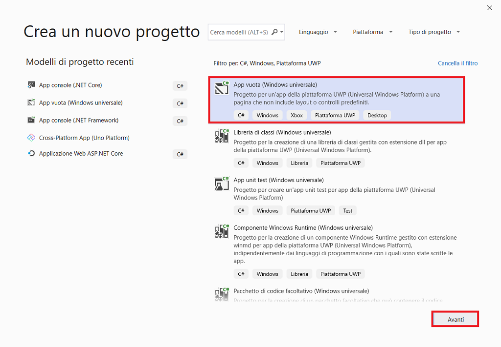

 Se il modello ***App vuota (Windows universale)*** non è visualizzato, è possibile installarlo dalla finestra ***Crea un nuovo progetto***. Nel messaggio ***L'elemento cercato non è stato trovato?*** scegliere il collegamento ***Installa altri strumenti e funzionalità***.

 Scegliere quindi il carico di lavoro ***Sviluppo di app per la piattaforma UWP (Universal Windows Platform)*** nel programma d'installazione di Visual Studio.

Scegliere quindi il pulsante ***Modifica*** nel programma d'installazione di Visual Studio. Quando è richiesto, salvare il lavoro. Scegliere quindi ***Continua*** per installare il carico di lavoro. 

4. Nella finestra di dialogo ***Nuovo progetto della piattaforma UWP (Universal Windows Platform)*** accettare le impostazioni predefinite per ***Versione di destinazione***: e ***Versione minima***:.

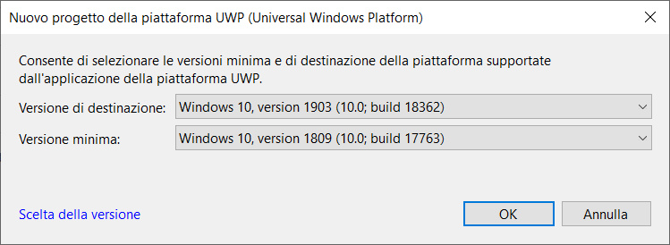

5. Nella finestra ***Configura il nuovo progetto*** digitare o immettere *Primo_Progetto_UWP* nella casella ***Nome del progetto***. Scegliere ***Crea***.

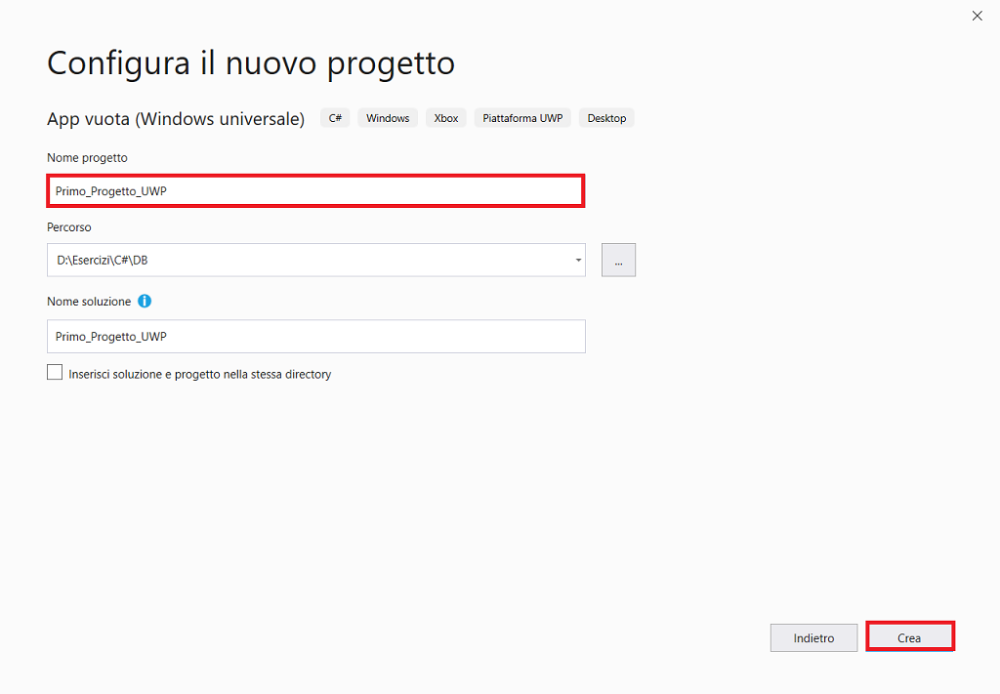

Se è la prima volta che si usa Visual Studio per creare app UWP, è possibile che sia visualizzata la finestra di dialogo ***Impostazioni***. Scegliere ***Modalità sviluppatore*** e ***S*ì**.

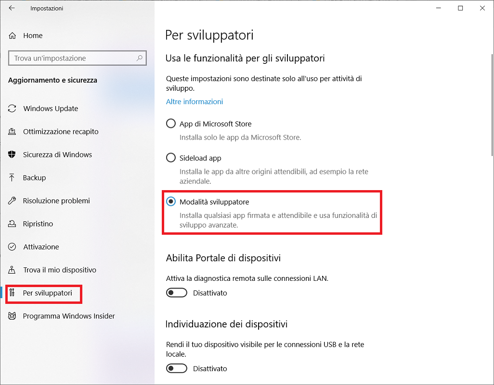

Visual Studio installa un pacchetto aggiuntivo di modalità sviluppatore per l'utente. Una volta completata l'installazione del pacchetto, chiudere la finestra di dialogo ***Impostazioni***.


## Creare l'app

A questo punto è possibile iniziare a sviluppare l'app. Sarà aggiunto un pulsante, sarà aggiunta un'azione al pulsante e l'app "Hello World" sarà avviata per visualizzarne l'aspetto.

In ***Esplora soluzioni*** fare doppio clic su *MainPage.xaml* per aprire una doppia visualizzazione.

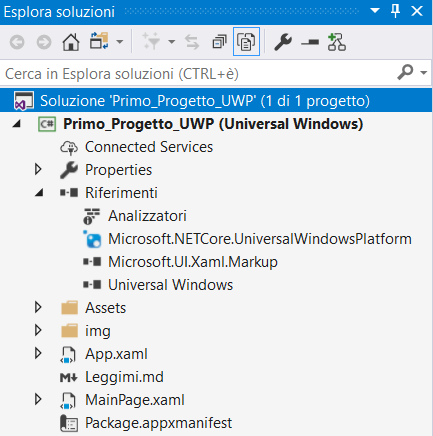

Sono disponibili due riquadri.

1. La **finestra di progettazione XAML** che include un'area di progettazione.
2. L'**editor XAML**, dove è possibile aggiungere o cambiare il codice.

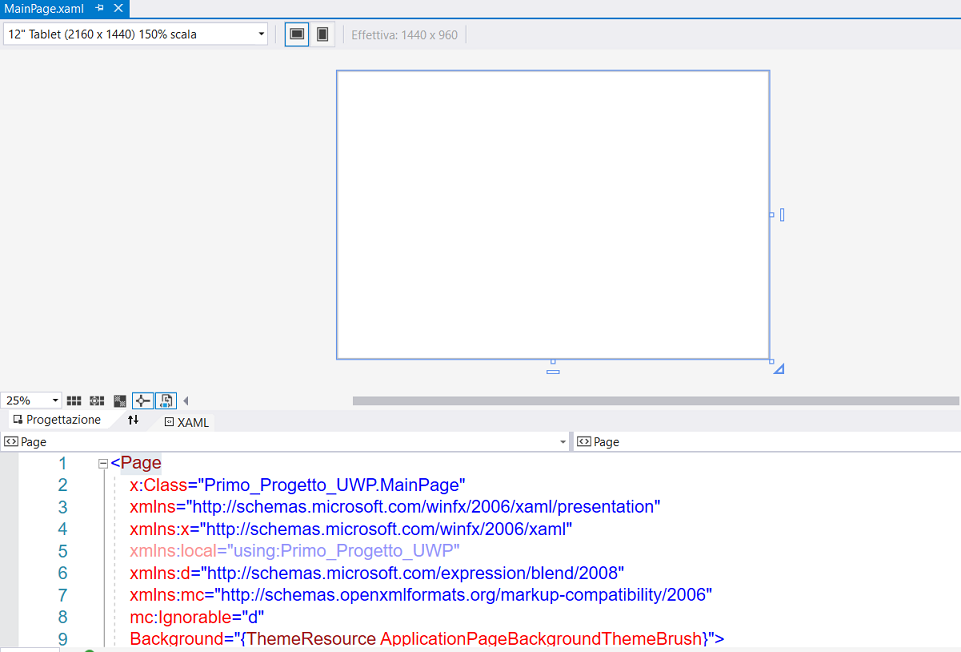

### Aggiungere un controllo Button

Scegliere ***Casella degli strumenti*** per aprire la finestra a comparsa della casella degli strumenti.

Se l'opzione ***Casella degli strumenti*** non è visualizzata, è possibile aprirla dalla barra dei menu. A tale scopo, scegliere ***Visualizza/Casella degli strumenti (CTRL+W,X)***. 

Fare clic sull'icona ***Blocca*** per ancorare la ***Casella degli strumenti***.

Fare clic sul controllo ***Button*** e trascinarlo nell'area di progettazione.

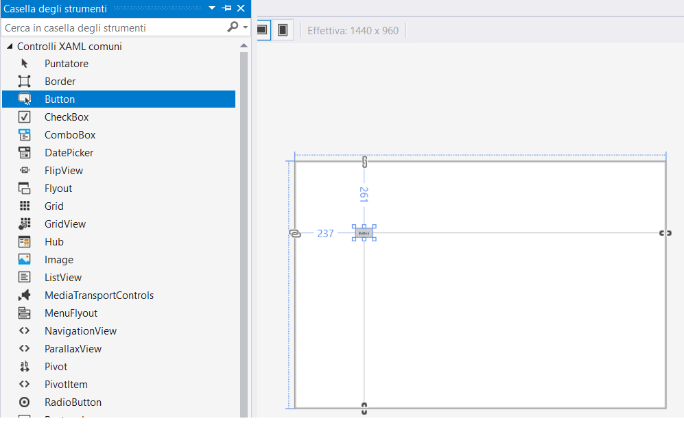Se si esamina il codice nell'**Editor XAML**, si noterà che il pulsante è stato aggiunto anche qui.

```xaml
<Page
    x:Class="Primo_Progetto_UWP.MainPage"
    xmlns="http://schemas.microsoft.com/winfx/2006/xaml/presentation"
    xmlns:x="http://schemas.microsoft.com/winfx/2006/xaml"
    xmlns:local="using:Primo_Progetto_UWP"
    xmlns:d="http://schemas.microsoft.com/expression/blend/2008"
    xmlns:mc="http://schemas.openxmlformats.org/markup-compatibility/2006"
    mc:Ignorable="d"
    Background="{ThemeResource ApplicationPageBackgroundThemeBrush}">
    <Grid>
        <Button Content="Button" Margin="237,261,0,0" VerticalAlignment="Top"/>
    </Grid>
</Page>

```

Nella finestra ***Proprietà*** per il controllo ***Button*** modificare la proprietà ***Nome*** (la proprietà nella parte superiore della finestra ***Proprietà*** ) in `BtnPremi`.

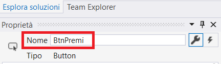


###### Aggiungere un'etichetta al pulsante

 Nell'**Editor XAML** modificare la proprietà ***Content*** da "Button" a "Hello, World!"

### Aggiungere un controllo TextBlock.

Aggiungere un controllo ***TextBlock*** all'area di progettazione trascinarlo nella finestra. 

Nella finestra ***Proprietà*** per il controllo ***TextBlock*** modificare la proprietà ***Nome*** (la proprietà nella parte superiore della finestra ***Proprietà*** ) in `TxbInforma`.

### Aggiungere due controlli RadioButton

Aggiungere due controlli ***RadioButton*** all'area di progettazione scegliendo l'elemento ***RadioButton*** e trascinandolo nell'area di progettazione nella finestra. Selezionare i pulsanti e usare i tasti di direzione per spostare i pulsanti in modo che siano visualizzati affiancati sotto il controllo ***TextBlock***.

Nella finestra ***Proprietà*** per il controllo ***RadioButton*** sinistro modificare la proprietà ***Nome*** (la proprietà nella parte superiore della finestra ***Proprietà*** ) in `RdbCiao`.

Nella finestra ***Proprietà*** per il controllo ***RadioButton*** destro modificare la proprietà ***Nome*** (la proprietà nella parte superiore della finestra ***Proprietà*** ) in `RdbAddio`.

È ora possibile aggiungere il testo visualizzato per ogni controllo ***RadioButton***. Nella procedura seguente sarà aggiornata la proprietà ***Contenuto*** per un controllo ***RadioButton***.

######  Aggiungere testo visualizzato per ogni pulsante di opzione

1.  Nell'area di progettazione aprire il menu di scelta rapida di `RdbCiao` facendo clic con il pulsante destro del mouse su `RdbCiao` , quindi scegliere ***Modifica testo*** e immettere `Ciao`.
2. Nell'area di progettazione aprire il menu di scelta rapida di`RdbAddio` facendo clic con il pulsante destro del mouse su `RdbAddio`, quindi scegliere ***Modifica* testo** e immettere `Addio`.

 Impostare un pulsante di opzione che dev'essere selezionato per impostazione predefinita

 In questo passaggio il pulsante di opzione `RdbCiao`è impostato in modo che sia selezionato per impostazione predefinita, così che uno dei due pulsanti di opzione sia sempre selezionato.

Nella visualizzazione XAML individuare il markup per `RdbCiao`e aggiungere  l'attributo ***IsChecked***.

###  Aggiungere un controllo Button

1. Nella ***Casella degli strumenti*** cercare il controllo ***Button*** e aggiungerlo all'area di progettazione sotto i controlli ***RadioButton*** .
2. Nella visualizzazione XAML modificare il valore di ***Content*** per il controllo ***Button*** da `Content="Button"` a `Content="Visualizza"` e salvare le modifiche.

```xaml
<Page
    x:Class="Primo_Progetto_UWP.MainPage"
    xmlns="http://schemas.microsoft.com/winfx/2006/xaml/presentation"
    xmlns:x="http://schemas.microsoft.com/winfx/2006/xaml"
    xmlns:local="using:Primo_Progetto_UWP"
    xmlns:d="http://schemas.microsoft.com/expression/blend/2008"
    xmlns:mc="http://schemas.openxmlformats.org/markup-compatibility/2006"
    mc:Ignorable="d"
    Background="{ThemeResource ApplicationPageBackgroundThemeBrush}">
    <Grid>
        <Button HorizontalAlignment="Left" Margin="118,102,0,0" VerticalAlignment="Top"
             x:Name="BtnPremi" Content="Hello, World!" Click="BtnPremi_Click" FontFamily="Segoe UI" />
        <TextBlock x:Name="TxbInforma" HorizontalAlignment="Center" Margin="0,102,0,0"
                   Text="Selezionare un'opzione per il messaggio, quindi scegliere il pulsante Visualizza." TextWrapping="Wrap"
                   VerticalAlignment="Top" RenderTransformOrigin="4.08,2.312" FontFamily="Segoe UI" FontSize="14" />
        <RadioButton x:Name="RdbCiao" Content="Ciao&#xD;&#xA;" Margin="397,231,0,0" VerticalAlignment="Top" IsChecked="True" />
        <RadioButton x:Name="RdbAddio" Content="Addio&#xD;&#xA;" Margin="787,231,0,0" VerticalAlignment="Top" />
        <Button x:Name="BtnVisualizza" Content="Visualizza" Margin="565,0,0,0" 
                Width="85" />
    </Grid>
</Page>
```

La finestra dovrebbe essere simile a quella illustrata nella figura di seguito.

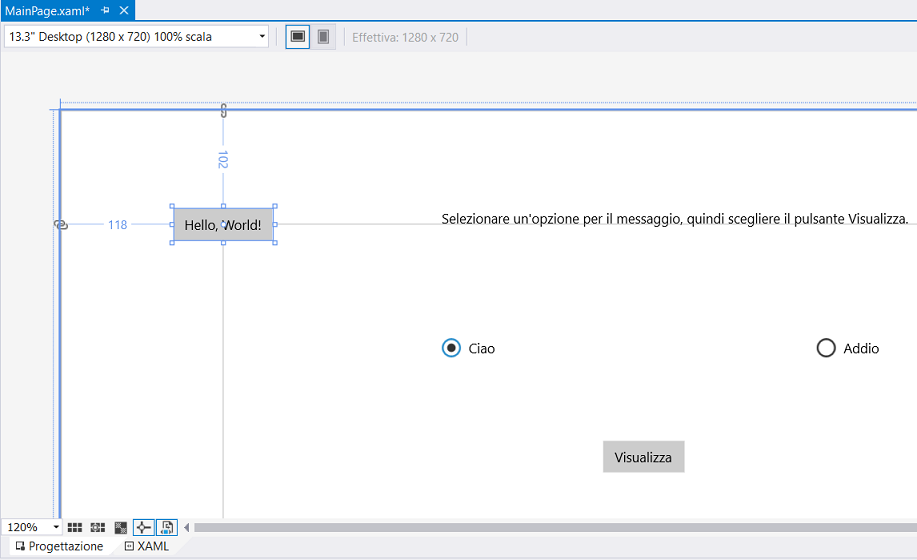

### Aggiungere un gestore dell'evento

 Il termine "gestore dell'evento" sembra qualcosa di complesso ma in realtà è solo un altro modo d'indicare il codice che è chiamato quando si verifica un evento. In questo caso, aggiunge un'azione a "Hello World!".

1. Fare doppio clic sul pulsante `BtnPremi` nell'area di progettazione.

2. Modificare il codice del gestore dell'evento in *MainPage.xaml.cs*, il file code-behind.

   Qui le cose si fanno interessanti. Il gestore dell'evento predefinito ha l'aspetto seguente.

```csharp
        private void BtnPremi_Click(object sender, RoutedEventArgs e)
        {

        }

```

### Aggiungere codice al pulsante Visualizza

 Quando l'app è in esecuzione, si apre una finestra di messaggio se si sceglie un pulsante di opzione e si seleziona il pulsante ***Visualizza***. Saranno visualizzate una finestra di messaggio per `RdbCiao` e una per `RdbAddio`. Per creare questo comportamento, è necessario aggiungere codice all'evento `BtnVisualizza_Click` .

Modificarlo in modo analogo al seguente.

```csharp
using System;
using Windows.UI.Popups;
using Windows.UI.Xaml;
using Windows.UI.Xaml.Controls;

namespace Primo_Progetto_UWP
{
    public sealed partial class MainPage : Page
    {
        public MainPage()
        {
            this.InitializeComponent();
        }

        private async void BtnPremi_Click(object sender, RoutedEventArgs e)
        {
            MediaElement mediaElement = new MediaElement();
            var synth = new Windows.Media.SpeechSynthesis.SpeechSynthesizer();
            Windows.Media.SpeechSynthesis.SpeechSynthesisStream stream = await synth.SynthesizeTextToStreamAsync("Hello, World!");
            mediaElement.SetSource(stream, stream.ContentType);
            mediaElement.Play();
        }

        private void BtnVisualizza_Click(object sender, RoutedEventArgs e)
        {
            if (RdbCiao.IsChecked == true)
            {
                MessageDialog dialog = new MessageDialog("Ciao!");
                dialog.ShowAsync();
            }
            else if (RdbAddio.IsChecked == true)
            {
                MessageDialog dialog = new MessageDialog("Addio");
                dialog.ShowAsync();
            }
        }
    }
}
```

Il codice usa alcune API Windows per creare un oggetto di sintesi vocale e assegnare un testo da pronunciare a tale oggetto. Per altre informazioni sull'uso di `SpeechSynthesis`, vedere [System.Speech.Synthesis](https://docs.microsoft.com/it-it/dotnet/api/system.speech.synthesis).


## Esecuzione dell'app

 A questo punto è possibile compilare, distribuire e avviare l'app UWP "Hello World" per verificarne l'aspetto e l'audio. 

1. Usare il pulsante di riproduzione (include il testo **Computer locale**) per avviare l'app nel PC locale.


In alternativa, è possibile scegliere ***Debug/Avvia debug (F5)*** dalla barra dei menu per avviare l'app.

Visualizzare l'app che è visualizzata subito dopo una schermata iniziale. L'app dovrebbe avere un aspetto simile al seguente.

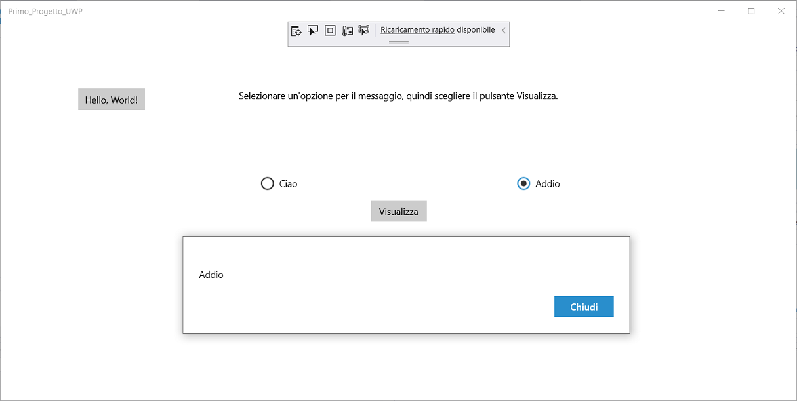

Fare clic sul pulsante **Hello World**.

Il dispositivo Windows 10 pronuncerà le parole "Hello, World!"

Per chiudere l'app, fare clic sul pulsante ***Arresta debug*** sulla barra degli strumenti. In alternativa, scegliere ***Debug/Arresta debug (MAIUSC+F5)*** dalla barra degli strumenti.


## Eseguire il debug e il test dell'app

 Sarà quindi eseguito il debug dell'app per rilevare eventuali errori e verificare che entrambe le finestre di messaggio siano visualizzate correttamente. 

 Avviare il debugger selezionando ***Debug/Avvia debug (F5)***.

Si apre la finestra ***Modalità interruzione***. La finestra ***Output*** indica che si è verificata un'eccezione IOException.

Arrestare il debugger scegliendo ***Debug/Termina debug***.

###### Eseguire il debug con punti d'interruzione

 Aggiungendo alcuni punti d'interruzione, è possibile testare il codice durante il debug. È possibile aggiungere punti d'interruzione selezionando ***Debug/Imposta/Rimuovi punto di interruzione (F9)***, facendo clic sul margine sinistro dell'editor accanto alla riga di codice in cui si vuole inserire l'interruzione.

 Accanto alla riga di codice nel margine di estrema sinistra della finestra dell'editor sarà visualizzato un cerchio rosso.

Premere ***F5*** per avviare il debug.

La riga è evidenziata in giallo. Nella parte inferiore dell'IDE, le finestre ***Auto***, ***Variabili locali*** ed ***Espressioni di controllo*** sono ancorate insieme sul lato sinistro e le finestre ***Stack di chiamate***, ***Punti di interruzione***, ***Impostazioni eccezione***, ***Comando***, ***Controllo immediato*** e ***Output*** sono ancorate insieme sul lato destro.


## Compilare una versione di rilascio dell'app

 Dopo aver verificato che tutto funzioni, è possibile preparare una build di rilascio dell'app.

1. Nel menu principale selezionare ***Compilazione/Pulisci soluzione*** per eliminare i file intermedi e di output creati durante le compilazioni precedenti. Questa operazione non è necessaria ma elimina l'output di compilazione di debug.
2. Modificare la configurazione della build da ***Debug*** a ***Release*** usando il controllo a discesa sulla barra degli strumenti (al momento è selezionato ***Debug***).
3. Compilare la soluzione scegliendo ***Compilazione/Compila soluzione***.

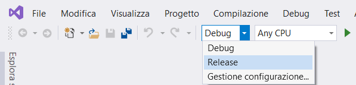


## Profiler 

È fornito con Visual Studio ed è ottimo per profilo UWP apps.

 Fare clic su ***Analizza/Profiler prestazioni... (ALT+F2)***.


È possibile scegliere tra le seguenti opzioni simili, per profilare l'app.

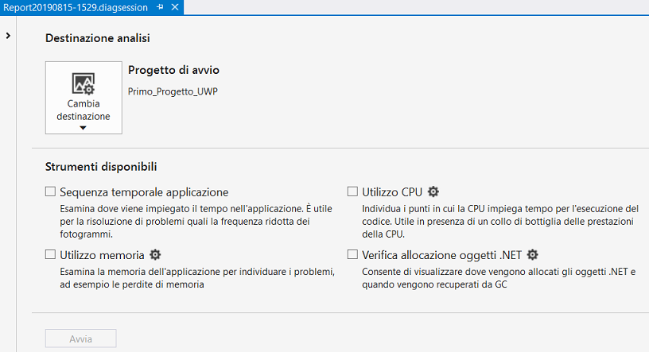


