# WTS (*WINDOWS TEMPLATE STUDIO*)

Scaricare il template dal [market place](https://marketplace.visualstudio.com/items?itemName=WASTeamAccount.WindowsTemplateStudio).

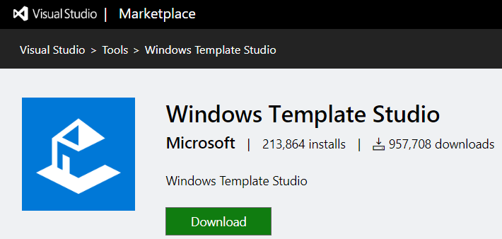

# PROGETTO: METEO

In primo luogo, si deve definire ciò che l’app sarà in grado di fare.

In questo esempio, si progetta un'app di previsioni meteo.

Alla fine del wizard, si definisce lo scheletro dell’app, quindi si è pronti per aggiungere le caratteristiche importanti legati alle condizioni atmosferiche.

Ci si può aiutare disegnando uno schizzo su carta.

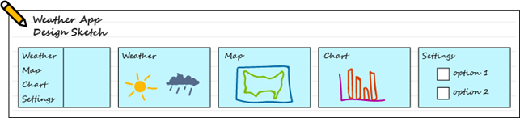

L’app deve permettere i seguenti punti.

- Utilizzare il controllo Visualizzazione struttura per passare tra diversi punti di vista.
- Visualizzare simboli meteo per la settimana su una pagina vuota.
- Utilizzare una visualizzazione mappa per mostrare l’attuale area di previsioni meteo.
- Visualizzare un grafico dei dati meteo precedenti.
- Avere una pagina d’impostazioni per consentire all’utente di selezionare opzioni.
- Utilizzare le notifiche per avvisare l’utente di situazioni meteo pericolose.

## Creare il progetto

In Visual Studio fare clic su ***Estensioni/Gestisci le estensioni***.

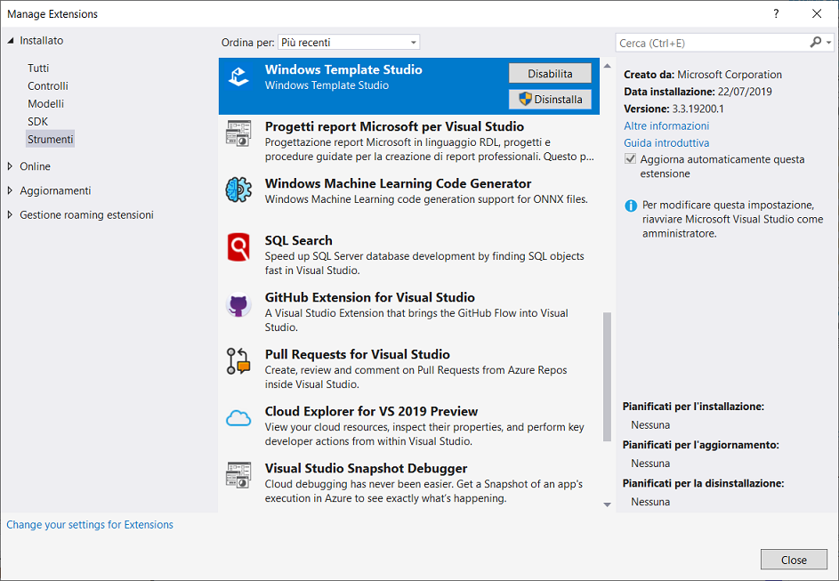

Il tipo di progetto include fin dall'inizio tutti i file modello necessari.

1. Aprire Visual Studio 2019.
2. Nella finestra iniziale scegliere ***Crea un nuovo progetto***.
3. Nella finestra ***Crea un nuovo progetto*** immettere o digitare *Windows Template Studio* nella casella di ricerca. 

Dopo aver applicato i filtri di linguaggio e piattaforma, scegliere il modello ***Windows Tempalte Studio  (Universal Windows* ** e quindi scegliere ***Avanti***.

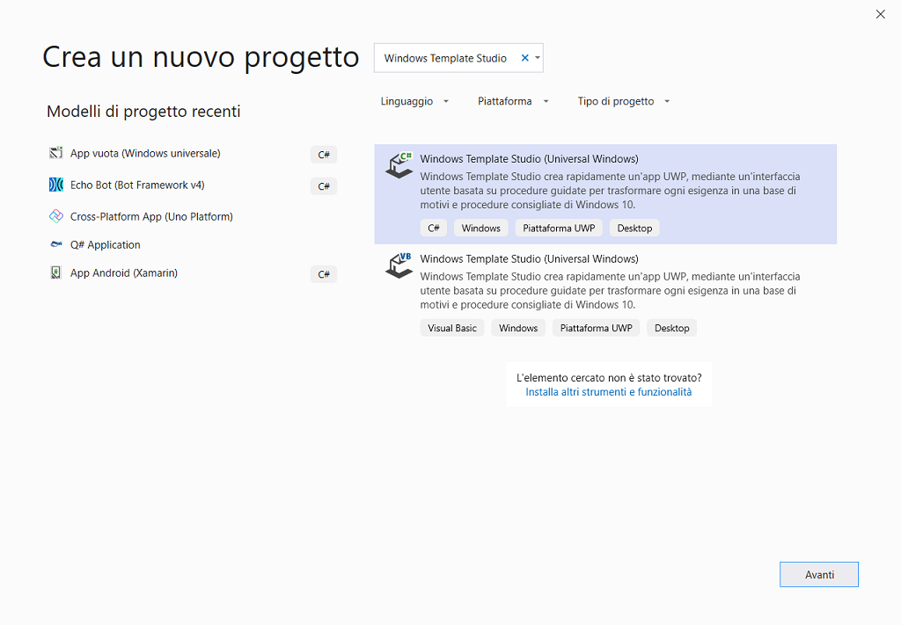

4. Nella finestra ***Configura il nuovo progetto*** digitare o immettere *Primo_Progetto_WTS* nella casella ***Nome del progetto***. Scegliere ***Crea***.

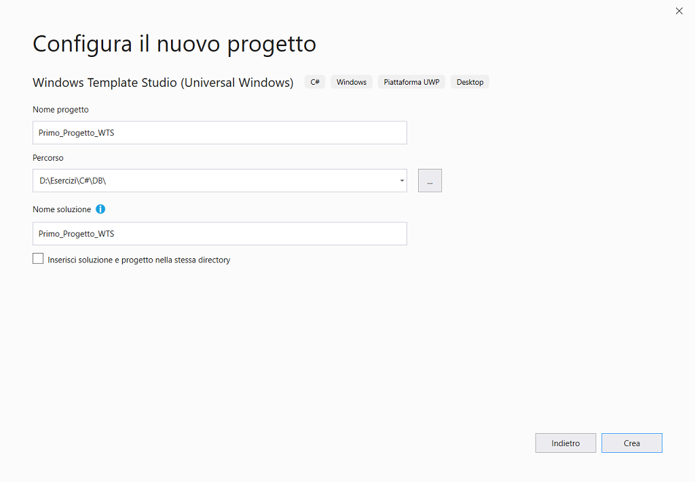

La procedura guidata apre la prima pagina, selezionare ***1. Tipo di progetto*** , come tipo ***Seleziona un tipo di progetto: Navigation Pane*** e fare clic su ***Avanti***.

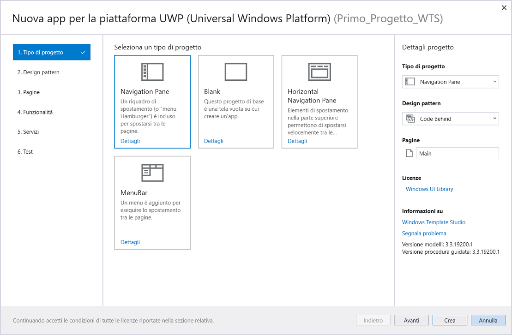

Saltare **2.** **Design pattern** e fare clic su ***Avanti***.

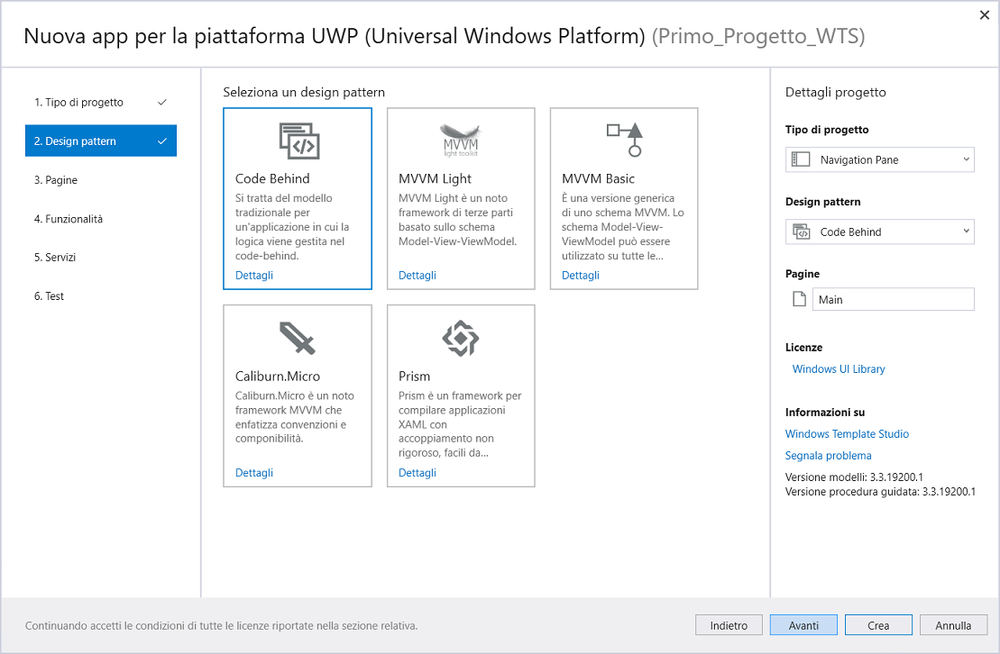

Selezionare **3. Pagine**, ognuna di queste pagine può essere aggiunta all’app, il nome della pagina e l’ordine sono modificabili nel pannello a destra, si vede una pagina vuota denominata **Main** aggiunta per
impostazione predefinita.

In ***Aggiungi pagine***, fare clic su ***+*** , quindi modificare il nome in **Previsione**, quindi aggiungere una pagina **Map**, una pagina **Chart** e una pagina **Setting** e fare clic su ***Avanti***.

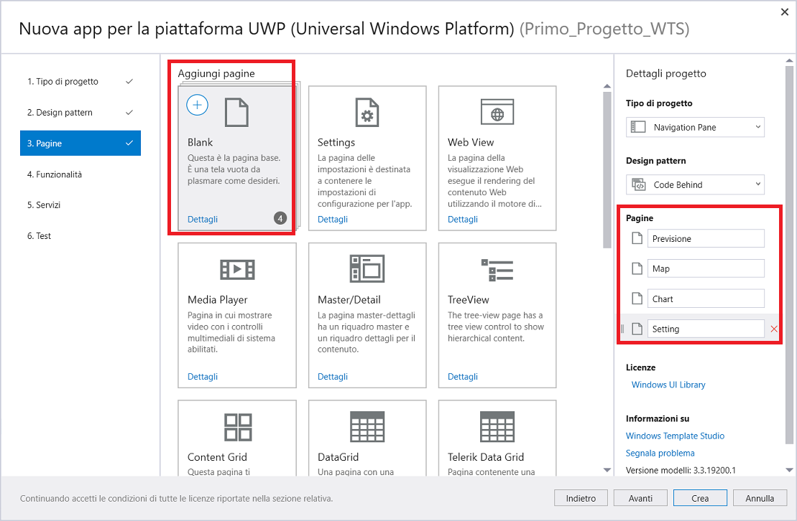

Selezionare **4. Funzionalità** , selezionare ***Interazione utente:  Toast Notifications***  e fare clic su ***Avanti***.

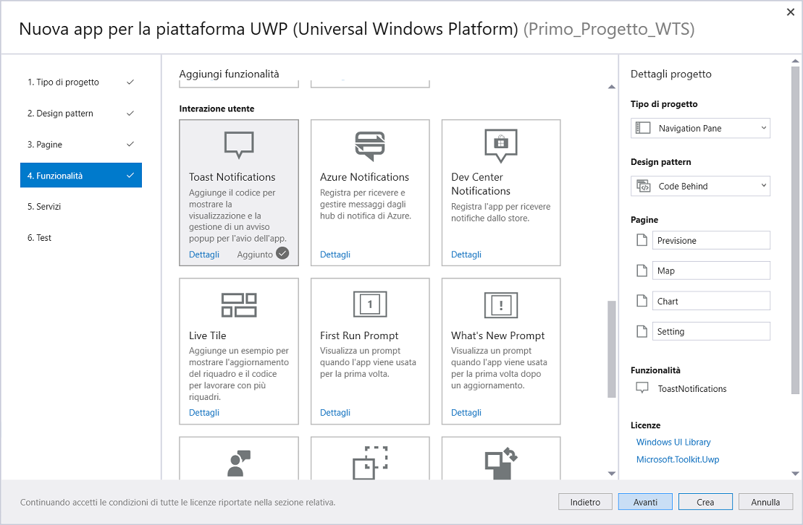

Fare clic su **Crea**.

Quando si crea il progetto, si genera la seguente soluzione.

In ***Esplora soluzioni*** espandere la cartelle.

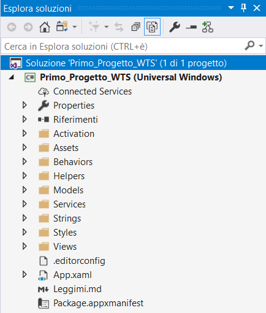

## Esecuzione dell'app

 A questo punto è possibile compilare, distribuire e avviare l'app per verificarne l'aspetto. 

Fare clic su ***Debug/Avvia senza eseguire debug (CTRL+F5)***.

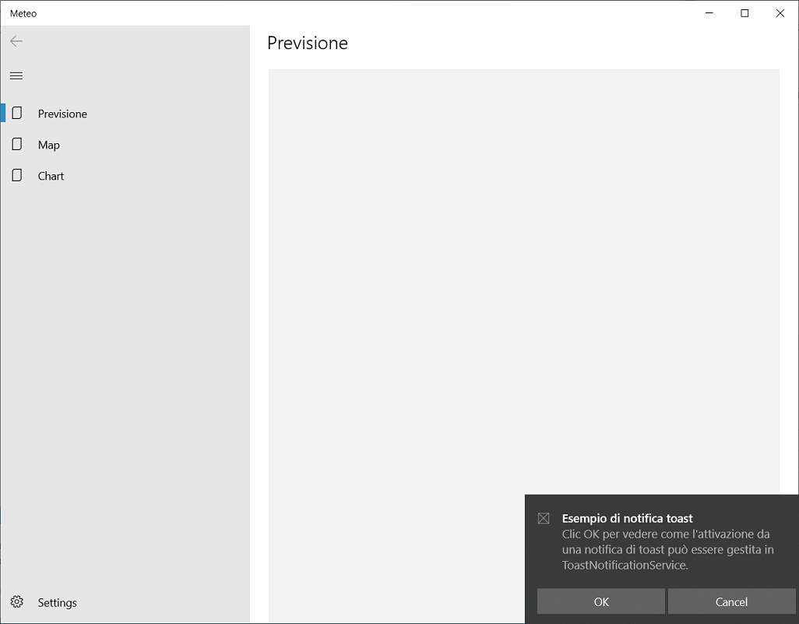