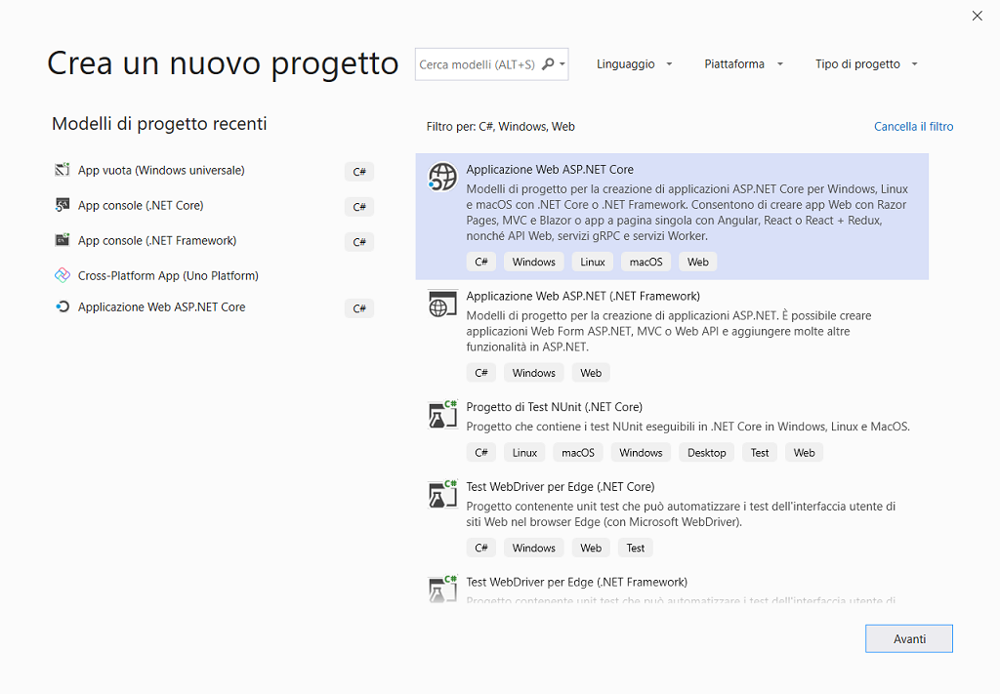
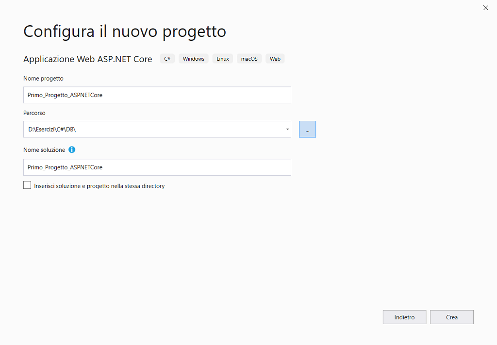
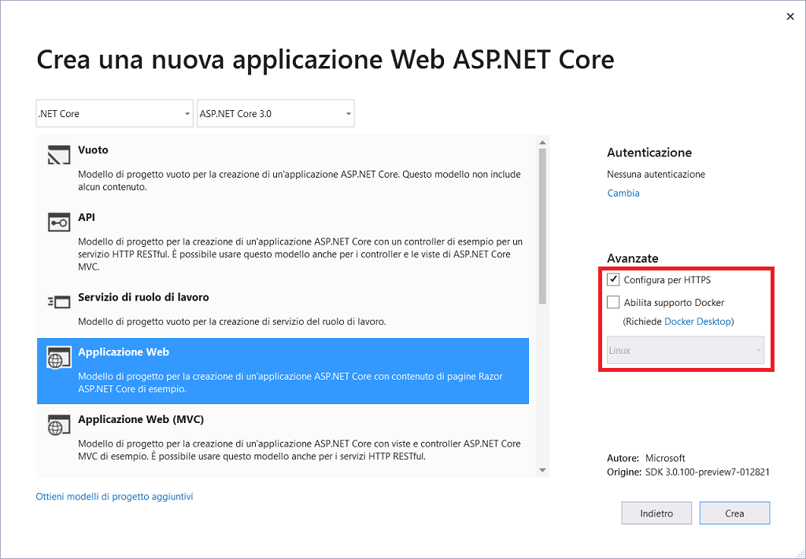
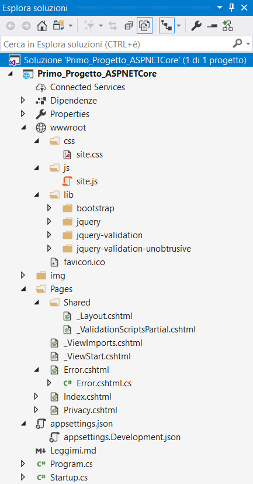
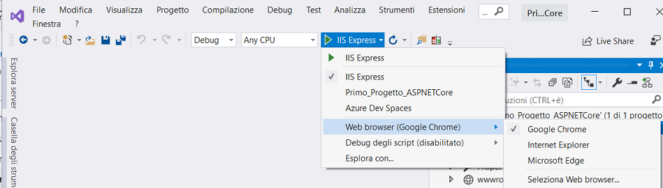

# Creare un'app ASP.Net Core C# in Visual Studio

In questa esercitazione per C# si userà Visual Studio per creare ed eseguire un'app ASP.NET Core ed esplorare nello stesso tempo alcune funzionalità dell'ambiente di sviluppo integrato **IDE** (*Integrated Development Environment*) di Visual Studio.

Se Visual Studio non è ancora installato, accedere alla pagina [Download di Visual Studio](https://visualstudio.microsoft.com/downloads/?utm_medium=microsoft&utm_source=docs.microsoft.com&utm_campaign=inline+link&utm_content=download+vs2019) per installarlo gratuitamente.


## Creare un progetto

 Per prima cosa, si creerà un progetto ASP.NET Core. Il tipo di progetto include fin dall'inizio tutti i file modello necessari.

1. Aprire Visual Studio 2019.
2. Nella finestra iniziale scegliere ***Crea un nuovo progetto***.
3. Nella finestra ***Crea un nuovo progetto*** immettere o digitare *console* nella casella di ricerca. Scegliere quindi **C#**  dall'elenco ***Linguaggio*** e ***Windows*** dall'elenco ***Piattaforma***.

Dopo aver applicato i filtri di linguaggio e piattaforma, scegliere il modello ***Applicazione Web ASP.NET Core* ** e quindi scegliere ***Avanti***.



 Se il modello ***Applicazione Web ASP.NET Core*** non è visualizzato, è possibile installarlo dalla finestra ***Crea un nuovo progetto***. Nel messaggio ***L'elemento cercato non è stato trovato?*** scegliere il collegamento ***Installa altri strumenti e funzionalità***.

 Scegliere quindi il carico di lavoro ***Sviluppo ASP.NET*** nel programma d'installazione di Visual Studio.

 Scegliere quindi il pulsante ***Modifica*** nel programma d'installazione di Visual Studio. Quando è richiesto, salvare il lavoro. Scegliere quindi ***Continua*** per installare il carico di lavoro. 

4. Nella finestra ***Configura il nuovo progetto*** digitare o immettere *Primo_Progetto_ASPNETCore* nella casella ***Nome del progetto***. Scegliere ***Crea***.



5. Nella finestra ***Crea una nuova applicazione Web ASP.NET Core*** verificare che ***ASP.NET Core 3.0*** sia visualizzato nel menu a discesa in alto. Scegliere quindi ***Applicazione Web*** che include un esempio di Razor Pages. Infine scegliere ***Crea***.



Visual Studio aprirà il nuovo progetto che include il codice predefinito.

 Questa soluzione segue lo schema progettuale ***Pagina Razor***. È diverso dallo schema progettuale [MVC (Model-View-Controller)](https://docs.microsoft.com/it-it/aspnet/core/tutorials/first-mvc-app/start-mvc?view=aspnetcore-2.1&tabs=aspnetcore2x), in quanto è semplificato in modo da includere il codice del modello e del controller all'interno della pagina Razor stessa.


## Creare l'app

A questo punto è possibile iniziare a sviluppare l'app. 

In ***Esplora soluzioni*** espandere la cartella ***Pages*** e quindi aprire *Index.cshtml*.



### Cartella Pages

 Contiene le pagine Razor e i file di supporto. Ogni pagina Razor è una coppia di file.

1. Un file con estensione *cshtml* contenente il markup HTML con codice C# che usa la sintassi Razor.
2. Un file con estensione *cshtml.cs* contenente il codice C# per la gestione degli eventi della pagina.

 I nomi dei file di supporto iniziano con un carattere di sottolineatura. Ad esempio, il file *_Layout.cshtml* configura elementi dell'interfaccia utente comuni a tutte le pagine. Questo file imposta il menu di navigazione nella parte superiore della pagina e le informazioni sul copyright in fondo alla pagina. Per altre informazioni, vedere [Layout in ASP.NET Core](https://docs.microsoft.com/it-it/aspnet/core/mvc/views/layout?view=aspnetcore-2.2).

Aprire *Index.cshtml*.

```csharp
@page
@model IndexModel
@{
    ViewData["Title"] = "Home page";
}
<div class="text-center">
    <h1 class="display-4">Benvenuto</h1>
    <p>Ulteriori informazioni su <a href="https://docs.microsoft.com/aspnet/core">creazione di web app con ASP.NET Core</a>.</p>
</div>
```

Aprire *Index.cshtml.cs*.

```csharp
using Microsoft.AspNetCore.Mvc.RazorPages;
using Microsoft.Extensions.Logging;

namespace Primo_Progetto_ASPNETCore.Pages
{
    public class IndexModel : PageModel
    {
        private readonly ILogger<IndexModel> _logger;

        public IndexModel(ILogger<IndexModel> logger)
        {
            _logger = logger;
        }

        public void OnGet()
        {
        }
    }
}
```

### Cartella wwwroot

Rappresenta la radice del sito web e contiene i file statici, ad esempio i file HTML, i file JavaScript e i file CSS. Per altre informazioni, vedere [File statici in ASP.NET Core](https://docs.microsoft.com/it-it/aspnet/core/fundamentals/static-files?view=aspnetcore-2.2).

### File appSettings.json

Contiene i dati di configurazione che gestiscono l'app web in fase di esecuzione, ad esempio le stringhe di connessione. Per altre informazioni, vedere [Configurazione in ASP.NET Core](https://docs.microsoft.com/it-it/aspnet/core/fundamentals/configuration/index?view=aspnetcore-2.2).

Il progetto contiene anche file di configurazione . La [configurazione](https://docs.microsoft.com/it-it/aspnet/core/fundamentals/configuration) predefinita dell'app è archiviata in *appsettings.json*. È possibile eseguire comunque l'override di queste impostazioni con *appsettings.Development.json*. Per visualizzare il file *appsettings.Development.json*, espandere il file *appsettings.json*.

Aprire *appsettings.json*.

```json
{
  "Logging": {
    "LogLevel": {
      "Default": "Information",
      "Microsoft": "Warning",
      "Microsoft.Hosting.Lifetime": "Information"
    }
  },
  "AllowedHosts": "*"
}
```

Aprire *appsettings.Development.json*.

```json
{
  "Logging": {
    "LogLevel": {
      "Default": "Debug",
      "System": "Information",
      "Microsoft": "Information"
    }
  }
}
```

### Classe Program.cs

Un'app ASP.NET Core crea un *host* all'avvio. L'host è un oggetto che incapsula tutte le risorse dell'app, ad esempio.

- Un'implementazione del server HTTP.
- I componenti middleware.
- Registrazione.
- Inserimento delle dipendenze.
- Configurazione.
- Contiene il punto d'ingresso per l'app.

Il motivo principale per cui tutte le risorse interdipendenti dell'app sono incluse in un unico oggetto è la gestione del ciclo di vita, vale a dire il controllo sull'avvio dell'app e sull'arresto normale.

Il metodo `CreateHostBuilder` configura un host con le opzioni usate comunemente.

- Usare [Kestrel](https://docs.microsoft.com/it-it/aspnet/core/fundamentals/?view=aspnetcore-2.2&tabs=windows#servers) come server web e abilitare l'integrazione IIS.
- Caricare la configurazione da *appsettings.json*, variabili di ambiente, parametri della riga di comando e altri origini di configurazione.
- Inviare l'output di registrazione alla console e ai provider di debug.

```csharp
using Microsoft.AspNetCore.Hosting;
using Microsoft.Extensions.Hosting;

namespace Primo_Progetto_ASPNETCore
{
    public class Program
    {
        public static void Main(string[] args)
        {
            CreateHostBuilder(args).Build().Run();
        }

        public static IHostBuilder CreateHostBuilder(string[] args) =>
            Host.CreateDefaultBuilder(args)
                .ConfigureWebHostDefaults(webBuilder =>
                {
                    webBuilder.UseStartup<Startup>();
                });
    }
}
```

### Classe Startup.cs

All'interno della classe `Startup`.

1. Sono configurati i servizi necessari per l'app.
2. Definita la pipeline di gestione delle richieste.

 I *servizi* sono componenti usati dall'app. Ad esempio, un componente di registrazione è un servizio. Il codice per configurare o *registrare* i servizi è aggiunto al metodo `Startup.ConfigureServices`.

 La pipeline di gestione delle richieste è strutturata come una serie di componenti *middleware*. Un componente middleware, ad esempio, potrebbe gestire le richieste per i file statici o reindirizzare le richieste HTTP a HTTPS. Ogni componente middleware esegue operazioni asincrone su un `HttpContext`, quindi richiama il componente middleware successivo della pipeline oppure termina la richiesta. Il codice per configurare la pipeline di gestione delle richieste è aggiunto al metodo `Startup.Configure`.

Per altre informazioni, vedere [Middleware di ASP.NET Core](https://docs.microsoft.com/it-it/aspnet/core/fundamentals/middleware/index?view=aspnetcore-2.2).

 Contiene il codice che configura il comportamento dell'app, ad esempio se richiede il consenso per i cookie. Per altre informazioni, vedere [Avvio dell'app in ASP.NET Core](https://docs.microsoft.com/it-it/aspnet/core/fundamentals/startup?view=aspnetcore-2.2).

```csharp
using Microsoft.AspNetCore.Builder;
using Microsoft.AspNetCore.Hosting;
using Microsoft.Extensions.Configuration;
using Microsoft.Extensions.DependencyInjection;
using Microsoft.Extensions.Hosting;

namespace Primo_Progetto_ASPNETCore
{
    public class Startup
    {
        public Startup(IConfiguration configuration)
        {
            Configuration = configuration;
        }

        public IConfiguration Configuration { get; }

        // questo metodo è chiamato dal runtime: aggiunge servizi al contenitore
        public void ConfigureServices(IServiceCollection services)
        {
            services.AddRazorPages();
        }

        // questo metodo è chiamato dal runtime: configura la pipeline delle richieste HTTP
        public void Configure(IApplicationBuilder app, IWebHostEnvironment env)
        {
            if (env.IsDevelopment())
                app.UseDeveloperExceptionPage();
            else
            {
                app.UseExceptionHandler("/Error");
                /* il valore HSTS predefinito è 30 giorni, è possibile modificare questa
                 * impostazione per gli scenari di produzione, vedere https://aka.ms/aspnetcore-hsts */
                app.UseHsts();
            }
            app.UseHttpsRedirection();
            app.UseStaticFiles();
            app.UseRouting();
            app.UseAuthorization();
            app.UseEndpoints(endpoints =>
            {
                endpoints.MapRazorPages();
            });
        }
    }
}
```

###### Routing

 Una *route* è un modello URL di cui è stato eseguito il mapping su un gestore. Il gestore è in genere una pagina Razor, un metodo di azione in un controller MVC o un tipo di middleware. Il routing di ASP.NET Core consente di controllare gli URL usati dall'app.

 Per altre informazioni, vedere [Routing in ASP.NET Core](https://docs.microsoft.com/it-it/aspnet/core/fundamentals/routing?view=aspnetcore-2.2).


## Esecuzione dell'app

 A questo punto è possibile compilare, distribuire e avviare l'app web per verificarne l'aspetto. 

1. Usare il pulsante ***IIS Express***.



Se è visualizzato il messaggio di errore ***Non è possibile connettersi al server Web 'IIS Express'*** , chiudere Visual Studio e quindi aprirlo usando l'opzione ***Esegui come amministratore*** dal menu di scelta rapida. Eseguire quindi di nuovo l'applicazione.

 Potrebbe essere visualizzato un messaggio in cui si chiede se accettare un certificato SSL di IIS Express. Per visualizzare il codice in un browser, scegliere ***Yes***, quindi scegliere ***Yes*** se si riceve un messaggio di avviso di sicurezza per il completamento.

Per altre informazioni, vedere [Considerare attendibile il certificato di sviluppo di ASP.NET Core HTTPS](https://docs.microsoft.com/it-it/aspnet/core/security/enforcing-ssl?view=aspnetcore-2.2#trust-the-aspnet-core-https-development-certificate-on-windows-and-macos).

Visual Studio avvia [IIS Express](https://docs.microsoft.com/it-it/iis/extensions/introduction-to-iis-express/iis-express-overview) ed esegue l'app. La barra degli indirizzi visualizza `localhost:port#` e non `example.com` o simili. Ciò accade perché `localhost` è il nome host standard per il PC locale. Localhost è usato solo per le richieste web del PC locale. Quando Visual Studio crea un progetto web, per il server web è usata una porta casuale.


## Server

 Un'app ASP.NET Core usa un'implementazione del server HTTP per l'ascolto delle richieste HTTP. Il server espone le richieste all'app sotto forma d'insieme di [funzionalità di richiesta](https://docs.microsoft.com/it-it/aspnet/core/fundamentals/request-features?view=aspnetcore-2.2) strutturate in un `HttpContext`.

ASP.NET Core include le implementazioni server seguenti.

- *Kestrel* è un server web multipiattaforma. Kestrel è spesso eseguito in una configurazione con proxy inverso tramite [IIS](https://www.iis.net/). In ASP.NET Core 2.0 o versione successiva Kestrel può essere eseguito come server perimetrale pubblico esposto direttamente a Internet.
- *Server HTTP IIS* è un server per Windows che usa IIS. Con questo server l'app ASP.NET Core e IIS sono eseguiti nello stesso processo.
- *HTTP.sys* è un server per Windows che non è usato con IIS.

Per altre informazioni, vedere [Implementazioni di server Web in ASP.NET Core](https://docs.microsoft.com/it-it/aspnet/core/fundamentals/servers/index?view=aspnetcore-2.2).